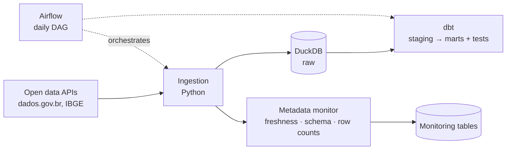

# opendata-watch

Monitors and cleans Brazilian open government datasets. It tracks when each dataset was last updated, catches schema changes and row-count drops, and publishes cleaned, tested tables.

> Status: in progress

## Why

Brazilian open data portals are a great source, but datasets go stale, change columns without notice and ship with inconsistent formats. opendata-watch makes that visible and gives you clean tables you can trust.

## How it works



1. **Ingest:** pull the selected datasets and their metadata from the source APIs.
2. **Monitor:** record last update, column list and row count on every run, and flag what changed.
3. **Clean:** dbt models standardize types, names and encodings; dbt tests guard keys and nulls.
4. **Orchestrate:** one Airflow DAG runs everything daily, with retries and idempotent, date-partitioned loads.

## Stack

Python · DuckDB · dbt · Apache Airflow · Docker

## Getting started

```bash
git clone https://github.com/bonushealth/opendata-watch.git
cd opendata-watch
# setup steps coming soon
```

## Datasets

| Dataset | Source | Refresh |
| --- | --- | --- |
| _to be defined_ | | |

## Roadmap

- [ ] Ingestion + metadata monitor for 2–3 datasets
- [ ] dbt cleaning models and data quality tests
- [ ] Daily Airflow DAG
- [ ] Architecture notes and technical decisions
